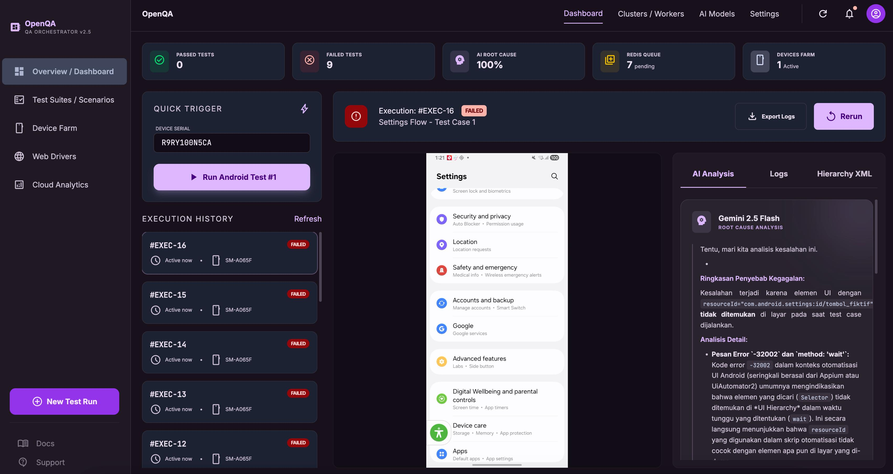
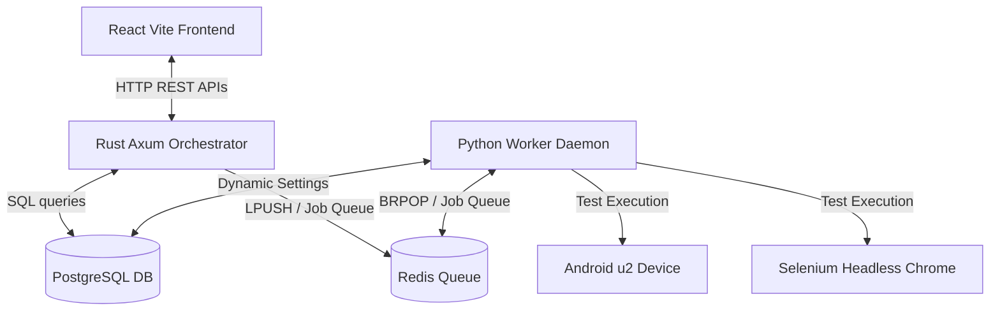

# OpenQA - Hybrid QA Automation Orchestrator



**OpenQA** adalah platform orkestrasi pengujian otomatis modern dan dinamis. Sistem ini menggabungkan performa tinggi backend **Rust Axum Core** dengan kelenturan skrip worker **Python Daemon** untuk menjalankan pengujian otomatis secara konkuren pada perangkat mobile (Android via `uiautomator2`) dan aplikasi web (Web via `Selenium WebDriver`).

---

## 🚀 Fitur Utama

- **Premium Dark Mode Dashboard**: Antarmuka berbasis React Vite + Tailwind dengan estetik glassmorphism dan mikro-animasi.
- **Dual-Platform Worker**:
  - **Android (uiautomator2)**: Menjalankan skrip pengetesan, merekam jalannya pengetesan secara native (`.mp4`), mendump XML UI Hierarchy saat error terjadi, dan menarik berkas logcat.
  - **Web (Selenium)**: Menjalankan pengujian otomatis browser Chrome (headless/UI), mendump DOM HTML saat error, serta mengambil screenshot kegagalan (`error_screenshot.png`).
- **Dynamic AI Prompting (Gemini)**: Integrasi dengan Google GenAI SDK untuk melakukan analisis akar masalah (*root cause analysis*) otomatis berdasarkan log error dan dump XML/HTML menggunakan model dinamis dari database.
- **Real-Time System Metrics**: Endpoint `/system-status` di Rust Axum memantau penggunaan CPU, Unified RAM macOS, status koneksi database (PostgreSQL + Redis), dan mendeteksi daemons Python yang aktif.
- **Slack Notification Webhook**: Sinkronisasi pengaturan webhook Slack langsung dari database untuk notifikasi kegagalan instan.

---

## 📐 Arsitektur Sistem

Sistem ini terbagi menjadi 3 komponen utama yang terhubung secara dinamis:



---

## 🛠️ Persyaratan Sistem

Pastikan peralatan berikut sudah terinstal di komputer Anda:
1. **Node.js** (v18 atau lebih baru)
2. **Rust & Cargo** (MSRV 1.75+)
3. **Python 3.10+** (dengan `virtualenv` aktif di folder `workers/.venv`)
4. **PostgreSQL** & **Redis Server**
5. **Android SDK & ADB** (untuk pengetesan Android)
6. **Google Chrome & ChromeDriver** (untuk pengetesan Selenium Web)

---

## ⚙️ Cara Instalasi & Menjalankan

### 1. Duplikasi & Konfigurasi Berkas Environment
Buat berkas `.env` pada direktori root project:
```env
GEMINI_API_KEY=API_KEY_GEMINI_ANDA
```

### 2. Konfigurasi Database (PostgreSQL & Redis)
Buat database bernama `openQA` di PostgreSQL Anda, lalu jalankan skrip migrasi berikut untuk membuat tabel dan data benih awal:
```sql
CREATE TABLE IF NOT EXISTS settings (
    key VARCHAR(50) PRIMARY KEY,
    value TEXT NOT NULL
);

INSERT INTO settings (key, value) VALUES
('gemini_model', 'gemini-2.0-flash'),
('system_prompt', 'Anda adalah asisten QA otomatis cerdas. Terjadi kesalahan saat menjalankan test case otomatis pada perangkat Android. Analisis log error dan XML, berikan penyebab serta proposed fix code.'),
('slack_webhook_url', ''),
('enable_slack', 'false')
ON CONFLICT (key) DO NOTHING;

-- Pastikan tabel test_cases dan test_executions sudah terbuat sesuai schema utama
```

### 3. Jalankan Rust Backend Orchestrator
Backend Rust bertugas sebagai pelayan API utama dan static server untuk berkas rekaman video / screenshots.
```bash
cargo run
```
*Server akan berjalan secara otomatis di port `http://localhost:3000`.*

### 4. Jalankan Python Worker Daemon
Worker bertugas sebagai pendengar antrean Redis (`qa_automation_queue`) dan mengeksekusi langkah-langkah pengetesan secara asinkron.
```bash
# Aktifkan virtualenv python
source workers/.venv/bin/activate

# Jalankan worker daemon
python -u workers/worker.py
```

### 5. Jalankan React Frontend Dashboard
Antarmuka visual untuk mengontrol seluruh alur pengetesan.
```bash
cd frontend-dashboard
npm install
npm run dev
```
*Dashboard dapat diakses melalui browser di alamat `http://localhost:5173`.*

---

## 🧪 Format Alur Skenario (JSON Steps)

### Android Settings Flow (Regression)
```json
[
  { "step_number": 1, "action": "app_start", "target": "com.android.settings", "description": "Buka Settings" },
  { "step_number": 2, "action": "wait", "value": "2.0", "description": "Tunggu 2 detik" },
  { "step_number": 3, "action": "click", "locator_type": "resource_id", "locator_value": "com.android.settings:id/tombol_fiktif", "description": "Klik tombol rahasia" }
]
```

### Web Login Flow (Selenium)
```json
[
  { "step_number": 1, "action": "get_url", "value": "https://the-internet.herokuapp.com/login", "description": "Buka halaman login" },
  { "step_number": 2, "action": "type", "locator_type": "id", "locator_value": "username", "value": "tomsmith", "description": "Input username" },
  { "step_number": 3, "action": "type", "locator_type": "id", "locator_value": "password", "value": "SuperSecretPassword!", "description": "Input password" },
  { "step_number": 4, "action": "click", "locator_type": "css", "locator_value": "button[type=\"submit\"]", "description": "Klik Submit" }
]
```

---

## 🖥️ Detail Endpoints Backend (Axum)

| Method | Endpoint | Deskripsi |
| :--- | :--- | :--- |
| `POST` | `/run-test/:test_case_id` | Menambahkan pekerjaan uji otomatis (Web/Android) ke Redis Queue. |
| `GET` | `/executions` | Mengambil seluruh riwayat log eksekusi dari database PostgreSQL. |
| `GET` | `/settings` | Mengambil konfigurasi aktif AI Model dan Webhook. |
| `POST` | `/settings` | Memperbarui atau menyimpan konfigurasi settings ke PostgreSQL. |
| `GET` | `/system-status` | Membaca utilitas CPU/RAM macOS, status PostgreSQL, Redis, dan daftar Worker PID aktif. |
| `GET` | `/static/outputs/*` | Menyajikan berkas rekaman video pengetesan (`video.mp4`), screenshots error, dan XML dump secara statis. |
